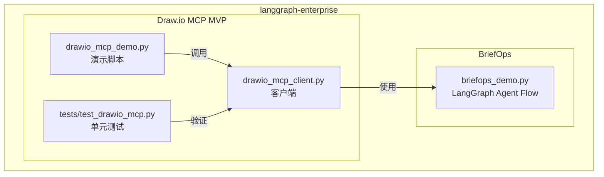
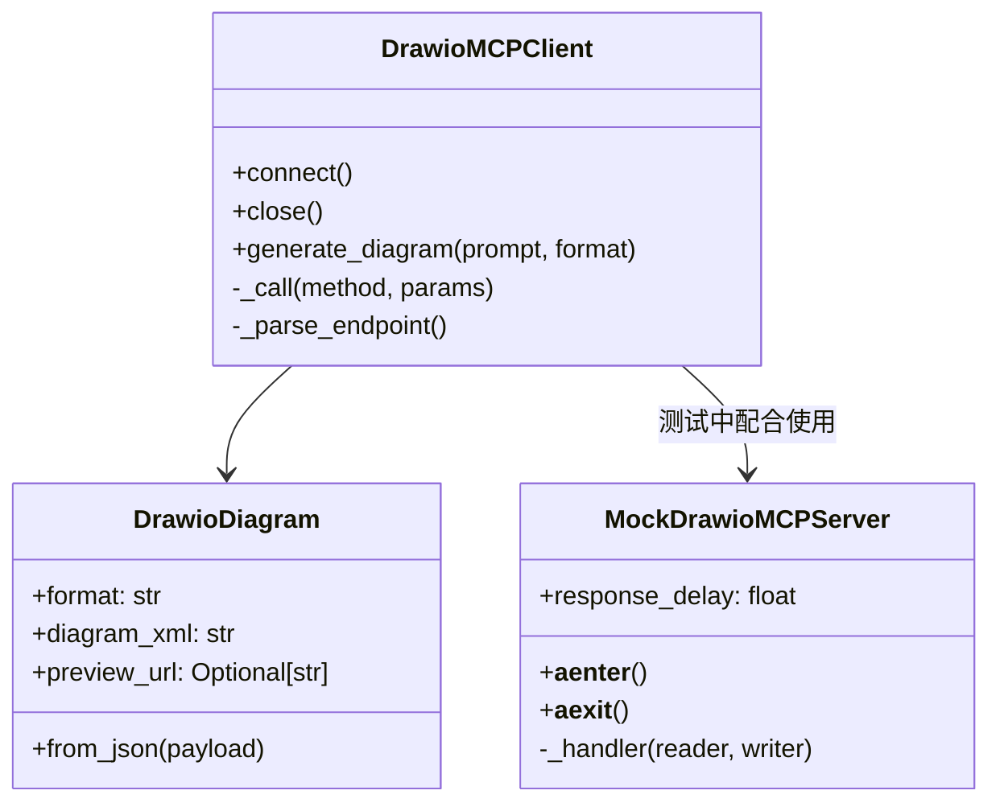
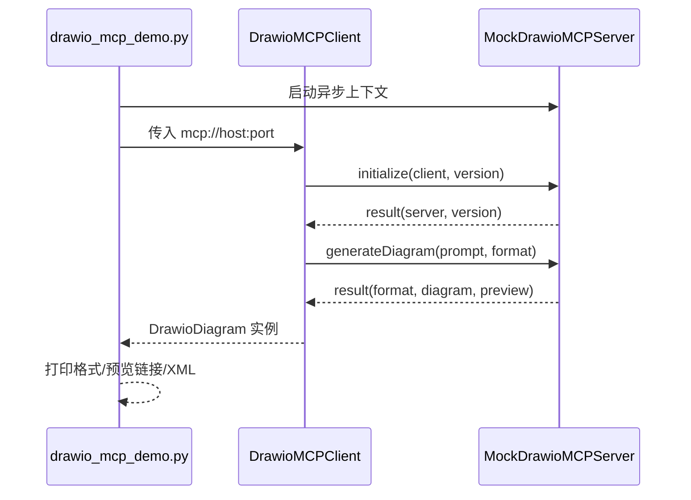

# Draw.io MCP MVP 设计与运行指南

本文件汇总了仓库中与 Draw.io Model Context Protocol (MCP) MVP Demo 相关的代码结构、数据流、时序交互以及运行验证方法，方便快速理解与复现。

## 仓库概览

| 模块 | 关键文件 | 说明 |
| --- | --- | --- |
| BriefOps 智能简报工作流 | `briefops/briefops_demo.py` | LangGraph 企业洞察多代理示例，展示 Planner → Searcher → Summarizer → Evaluator → Publisher 的闭环。 |
| Draw.io MCP Demo | `briefops/drawio_mcp_client.py`、`briefops/drawio_mcp_demo.py` | 以 TCP + JSON-RPC 模拟 Draw.io MCP 服务器与客户端交互的最小可用示例（MVP）。 |
| 自动化验证 | `tests/test_drawio_mcp.py` | 覆盖成功生成流程、错误处理与超时控制的单元测试。 |

## 架构设计



### Draw.io MCP 组件关系



### 时序图：生成流程



## 运行步骤

### 1. 安装依赖（建议虚拟环境）

```bash
python3 -m venv .venv
source .venv/bin/activate
pip install -r briefops/requirements.txt
```

> 说明：`DrawioMCPClient` 仅依赖标准库，安装依赖主要用于运行 LangGraph Demo 与测试。

### 2. 运行 Draw.io MCP Demo

```bash
python -m briefops.drawio_mcp_demo
```

预期输出（示例）：

```
Draw.io MCP demo
----------------
Prompt       : MVP architecture for a Draw.io MCP integration
Format       : svg
Preview URL  : https://mock.local/svg/MVP_architecture_for_a_Draw.io_MCP_integration
Diagram XML  : <diagram>MVP architecture for a Draw.io MCP integration</diagram>
```

> 每次执行都会通过 `MockDrawioMCPServer` 启动一个临时监听端口，客户端完成 `initialize` 后发出 `generateDiagram` 请求，最终返回带有示例 XML 与预览 URL 的 `DrawioDiagram` 数据类实例。

### 3. 运行自动化测试验证

```bash
pytest tests/test_drawio_mcp.py -q
```

测试覆盖点：

1. **成功流程**：验证 `generate_diagram` 返回的格式、XML 与预览链接包含输入 Prompt。
2. **错误分支**：向客户端发送未知方法，确认抛出 `DrawioMCPError`。
3. **超时控制**：在服务端加入延迟，验证客户端的超时设定生效。

全部测试通过即说明 MVP 客户端、Mock 服务器与 Demo 脚本协同工作正常。

## 关键实现摘要

- **连接与握手**：`DrawioMCPClient.connect` 使用 `asyncio.open_connection` 与服务器建立 TCP 连接，并自动完成 JSON-RPC 的 `initialize` 调用。
- **RPC 调用**：`_call` 方法负责编码/发送请求、处理通知与错误，并在需要时应用 `asyncio.wait_for` 超时约束。
- **结构化返回**：`DrawioDiagram` 数据类将服务器返回的 JSON 转换为强类型对象，方便后续处理。
- **Mock 服务器**：`MockDrawioMCPServer` 通过 `asyncio.start_server` 启动本地监听，解析客户端 JSON-RPC 请求，根据 method 返回固定模板数据，确保 Demo 可在离线/受限环境运行。

## 扩展建议

1. 将传输层替换为 WebSocket，与真实 Draw.io MCP 完全对接。
2. 为 `MockDrawioMCPServer` 引入更多验证逻辑（如图层定义、错误码矩阵）。
3. 在 BriefOps 主工作流中集成 Diagram 生成节点，自动在简报中插入流程图。 

---

> 如需在文档外获取更多背景，可阅读 `briefops/README.md` 获取 BriefOps LangGraph 工作流的详细设计。
